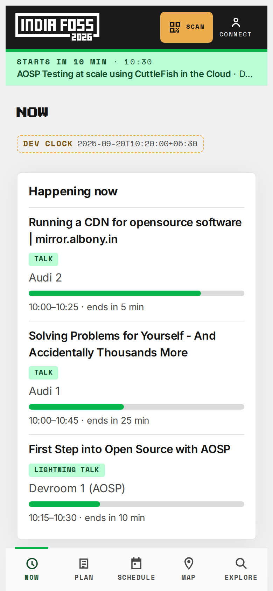
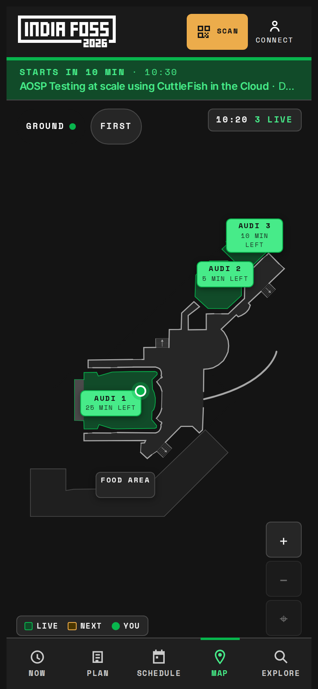
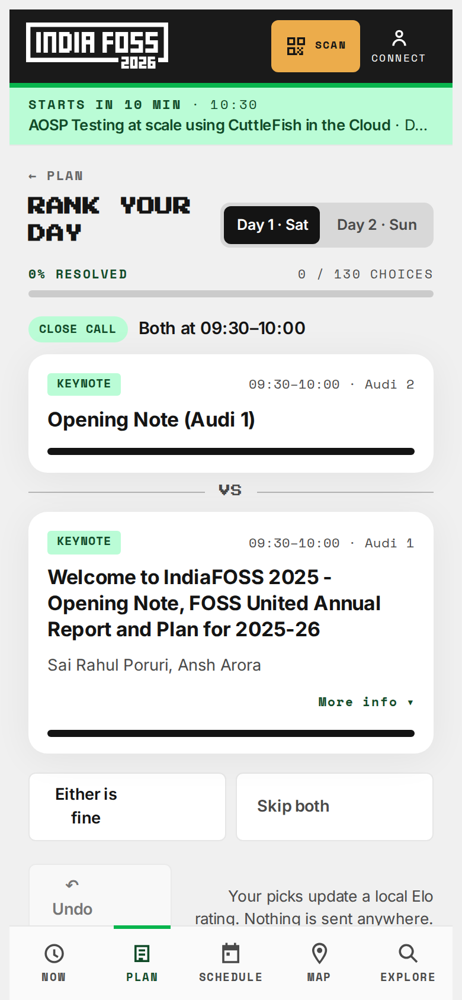
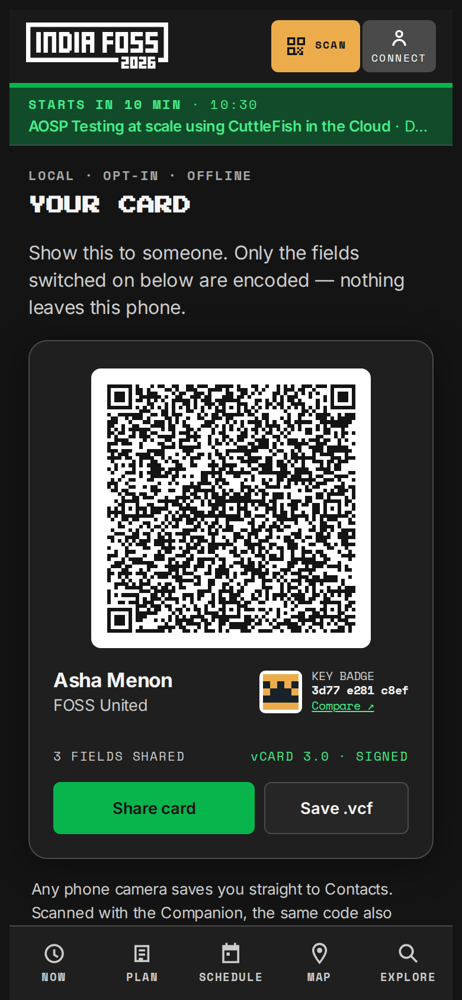
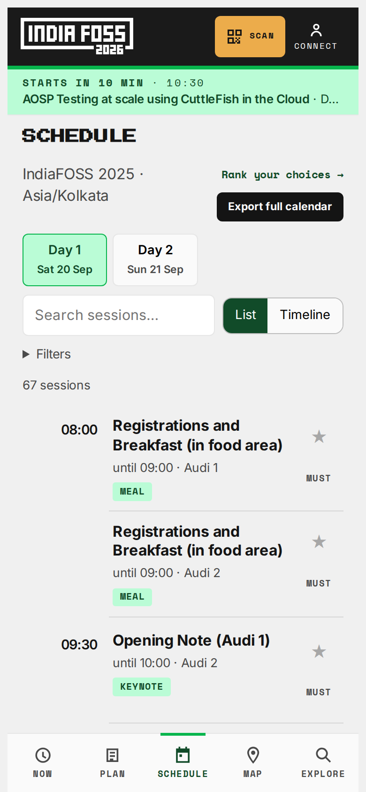
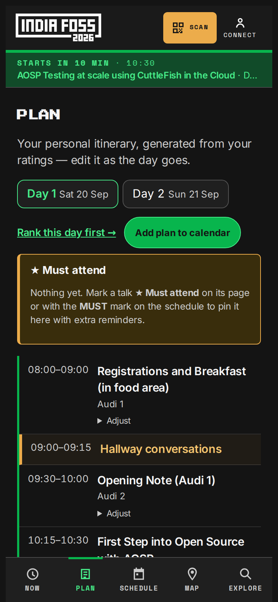
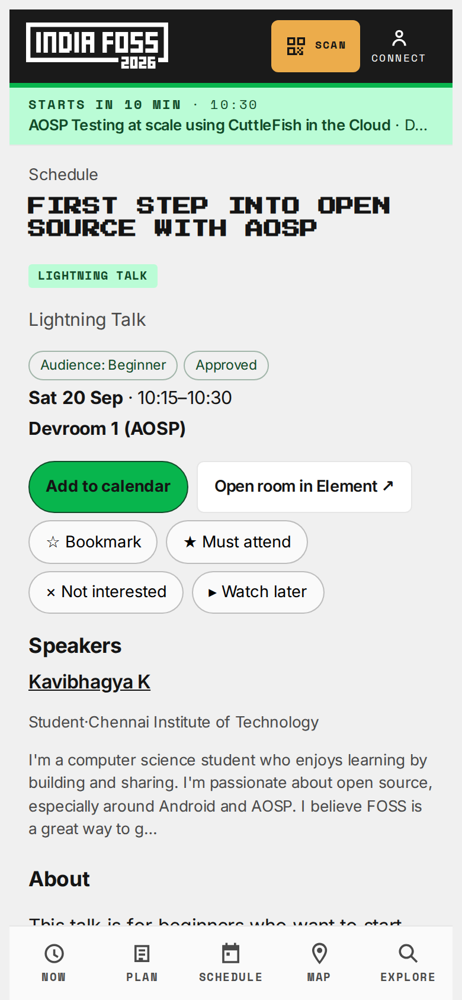
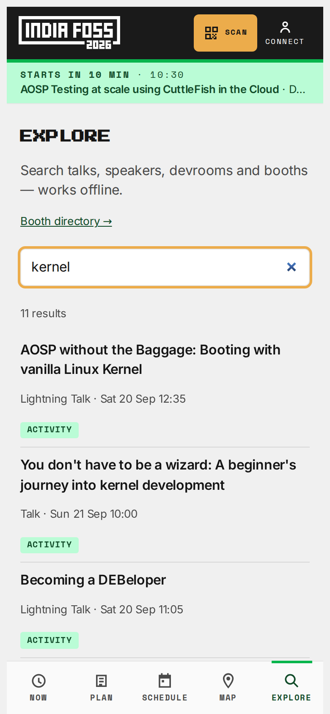
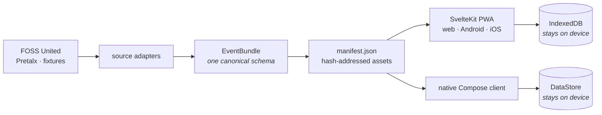

<div align="center">

# IndiaFOSS Companion

**The conference in your pocket — schedule, personal ranking, itinerary and indoor navigation, all offline, no account.**

[](https://github.com/hanthor/indiafoss-companion/actions/workflows/ci.yml)
[](https://github.com/hanthor/indiafoss-companion/releases/tag/nightly)
[](LICENSE)
[](https://hanthor.github.io/indiafoss-companion/)

[**Open the web app**](https://hanthor.github.io/indiafoss-companion/) · [**Install the Android nightly**](https://github.com/hanthor/indiafoss-companion/releases/tag/nightly) · [Docs](#documentation)





</div>

> [!NOTE]
> This project and its implementation were generated with AI assistance. It is an unofficial community project, is not produced or endorsed by FOSS United, and needs human review before production use.

---

An offline-first companion for [IndiaFOSS](https://indiafoss.fossunited.org/), built around the four questions you actually ask on a conference floor.

## 1. What is happening right now?

<table>
<tr>
<td width="60%">

Every hall, live, with a progress bar and the minutes left in each talk — so you can tell at a glance whether it is worth walking over or whether you have already missed it.

A banner across every tab counts down to your next session and turns amber when it is time to move. Sessions you mark **★ Must attend** are pinned, remind you 30 minutes ahead, and take priority over ordinary bookmarks.

The clock is honest about time zones: everything renders in the event's offset, not the phone's.

</td>
<td width="40%"></td>
</tr>
</table>

## 2. What should I do next?

<table>
<tr>
<td width="40%"></td>
<td width="60%">

A programme with 130 talks has more conflicts than anyone wants to resolve by reading abstracts. So the app takes two quick rounds: a **quick pass** down the day's list (Yes or No per talk), then only the Yeses that **overlap** are shown **two at a time** — which would you rather be in?

Each pick updates a local [Elo](https://en.wikipedia.org/wiki/Elo_rating_system) rating. Only questions that change the plan are asked: never two talks you could attend both of, never a clash a wide rating gap has already settled. The pill tells you why this pair — `OVERLAP`, `CLOSE CALL` or `NEW TO YOU` — and the app learns your taste by track and topic, so talks you have not ranked borrow it ([docs/ranking.md](docs/ranking.md)).

Your ratings never leave the phone.

</td>
</tr>
</table>

## 3. How do I get there?

<table>
<tr>
<td width="60%">

The venue's real floor plan, with halls lit up while sessions run in them and a dot for where you are — set by scanning the QR on a room door, or by tapping **I'm here**.

Both floors are drawn as vectors, so pinch, drag and wheel zoom stay sharp, and a corner hint tells you when your next talk is on the other floor. Underneath is a routing graph with A\* pathfinding and accessible profiles (lift instead of stairs).

</td>
<td width="40%"></td>
</tr>
</table>

## 4. Who did I just meet?

<table>
<tr>
<td width="40%"></td>
<td width="60%">

One live QR card, re-encoded as you type. Every field has its own switch, so you choose what a stranger gets — GitHub yes, phone number no.

It is a plain **vCard 3.0** that any camera app can save, carrying the companion's extras as `X-` properties and a signature from a per-device key. Scanning someone back shows a pixel **key badge** and where you met them; if their key ever changes, the app says so instead of quietly overwriting them.

Nothing is uploaded. There is no server to upload to.

</td>
</tr>
</table>

## More of it

<div align="center">




</div>

<div align="center"><sub>Schedule · Plan · Session detail · Search — screenshots are time-travelled to day one, which is what the <code>DEV CLOCK</code> badge is showing.</sub></div>

Beyond the four screens above: a **personal itinerary** solved from your ratings as a weighted longest-path over the day (with hallway and coffee time placed in the gaps, and manual overrides that stick), **offline search** across talks, speakers, devrooms and booths, a **booth directory**, **calendar export** for your plan or the whole programme, and **local reminders** that fire without a server.

## Why it is built this way

- **Offline-first, not offline-tolerant.** After one download everything works in airplane mode — schedule, search, map, routing, Elo, itinerary. The release gate is a Playwright suite that walks the whole attendee flow with the network disabled.
- **No account, no tracking, no server.** Preferences, ratings, itinerary, notes and contacts live in IndexedDB on the device. There is nothing to sign into and nothing to leak.
- **One canonical bundle.** Every upstream source (FOSS United, Pretalx, fixtures) is normalised into a single `EventBundle` schema; no screen ever reads raw upstream data. Updates are hash-addressed and immutable, downloaded in full and parsed before they replace anything, so a half-finished download can never show you a broken schedule.
- **Accessibility is tested, not asserted.** axe-core WCAG A/AA runs over every core screen in _both_ colour schemes on every PR.



## Optional extras

Neither is on unless you switch it on.

- **Conference rooms on Matrix.** FOSDEM-style public rooms on the organiser's homeserver — one per hall, plus announcements and hallway — joined from whatever Matrix account you already have, via Element links. The companion never signs in there. Provisioned by `tools/matrix-rooms`; see [docs/messaging.md](docs/messaging.md).
- **Peer-to-peer chat.** Session, booth and direct chats over a Bluetooth/Wi-Fi mesh through an embedded Neutrino node in the Android app, with replies, reactions and an offline outbox. Off until you enable it in Settings. Neutrino is pre-alpha, so the mesh has no typing indicators, receipts, media or encryption yet — [measured, not assumed](docs/neutrino-capabilities.md).

## Try it

- **Web / PWA** — <https://hanthor.github.io/indiafoss-companion/>, deployed from `main`. Installable; works offline after the first load.
- **Android** — the rolling [`nightly`](https://github.com/hanthor/indiafoss-companion/releases/tag/nightly) pre-release carries the latest debug APK and its SHA-256. P2P chat is compiled in when the Neutrino bindings are published; they are built from source by a workflow, so no contributor needs a token ([docs](docs/messaging.md#building-the-p2p-variant)).
- **Android via Accrescent** — the channel we are heading for: install [Accrescent](https://accrescent.app), install the Companion from it, and it stays up to date on its own, in the background, with the signing key verified against signed store metadata. Accrescent's developer sign-up is closed at the moment, so this is not live yet — [what it needs, and what attendees will do](docs/accrescent.md).
- **iOS** — the PWA is iOS-ready: **Share → Add to Home Screen**. Apple touch icon and standalone metadata are in the build; no App Store account needed.

## Make it yours

This is meant to be forked. The programme, the floor plan, the branding and the
messaging config are all **data**, and the seams between them and the code are
where you work — a different conference should not mean touching a screen.

- **[Fork this app](docs/forking.md)** — point it at your event, draw your
  venue, swap the tokens and icons, and delete the features your conference
  does not have. Also: the two obligations that come with the fork (AGPL source
  offer, and re-branding away from FOSS United's assets).
- **[Write your own client](docs/mesh-protocol.md)** — the mesh is plain Matrix
  plus a handful of conventions, all specified: how rooms are named so
  independent clients converge, the backoff a client owes the hall when a talk
  starts, the question and identity-card formats, and what the mesh measurably
  cannot do yet. No part of this repository is required to interoperate.

## Repository layout

```text
apps/
  web/                 SvelteKit + Svelte 5 PWA — the primary client
  android/capacitor/   Capacitor wrapper — the shipping Android app
  android/native/      Jetpack Compose client (Material 3, dynamic colour)
packages/
  model/               canonical domain model + validation
  schedule/            schedule engine (grouping, filtering, time math)
  elo/                 Elo rating engine + comparison selection
  solver/              itinerary solver (weighted DAG)
  venue/               venue routing graph, A*/Dijkstra pathfinding
  search/              local offline search
  storage/             IndexedDB persistence
  matrix/              Matrix layer: sync, offline outbox, handoff links
  sources/             event source adapters
  test-fixtures/       shared fixtures
tools/
  event-sync/          fetch / normalise / validate / publish event bundles
  matrix-rooms/        provision the conference rooms idempotently
  venue-validator/     venue SVG / graph / metadata validation
  fixture-recorder/    capture upstream responses as fixtures
events/
  indiafoss-2025/      historical fixture (raw + normalised)
  indiafoss-2026/      venue floor plan fixture
  synthetic/           hand-authored edge-case fixture
```

## Development

Node.js ≥ 20.19 and pnpm 11 (`corepack enable`).

```bash
pnpm install
pnpm --filter @indiafoss/web dev      # the app on :5173
```

```bash
just check    # format, lint, typecheck, tests, asset verification, build
just ci       # check + browser E2E + a11y + the offline gate
just a11y     # accessibility suite only
just sbom     # CycloneDX SBOM (pnpm-aware)
```

Vitest everywhere, `fast-check` for property tests, Playwright for browser E2E
(`apps/web/tests/`) including the release-blocking offline gate and the
axe-core accessibility sweep.

Build the PWA:

```bash
pnpm --filter @indiafoss/web build     # → apps/web/build (PWA + service worker)
```

Android (needs an Android SDK and JDK 21):

```bash
pnpm --filter @indiafoss/android exec cap add android   # once
pnpm --filter @indiafoss/android build                  # patch + sync web assets
cd apps/android/capacitor/android && ./gradlew assembleDebug
```

The parallel native Compose client builds on its own, with no Node step — see
[docs/native-client.md](docs/native-client.md):

```bash
cd apps/android/native && ./gradlew :core:test :app:assembleDebug
```

Regenerate the screenshots in this README (they are time-travelled to day one
so the screens have live data):

```bash
pnpm --filter @indiafoss/web build
pnpm --filter @indiafoss/web screenshots
```

## Documentation

|                                                                                                                                                       |                                                                             |
| ----------------------------------------------------------------------------------------------------------------------------------------------------- | --------------------------------------------------------------------------- |
| [Event onboarding](docs/event-onboarding.md)                                                                                                          | bring a new event into the app                                              |
| [Venue map](docs/venue-map.md) · [route checklist](docs/venue-route-review-checklist.md)                                                              | floor plans and the routing graph                                           |
| [Reminders](docs/reminders.md) · [Day simulator](docs/simulator.md)                                                                                   | the notification tiers, and running a whole day in minutes                  |
| [Ranking](docs/ranking.md)                                                                                                                            | the quick pass, head to head, and the learnt taste                          |
| [Contact sharing](docs/contact-sharing.md)                                                                                                            | signed cards, QR scanning, key continuity                                   |
| [Calendar export](docs/calendar-export.md)                                                                                                            | ICS for a plan or the whole programme                                       |
| [**Fork this app**](docs/forking.md)                                                                                                                  | make it your conference: data, venue, branding, what to delete              |
| [**Mesh protocol**](docs/mesh-protocol.md)                                                                                                            | the interop spec — write your own client and join the mesh                  |
| [Messaging](docs/messaging.md) · [Neutrino capabilities](docs/neutrino-capabilities.md) · [P2P state of the art](docs/p2p-matrix-state-of-the-art.md) | Matrix rooms, P2P mesh, threat model, and what the mesh measurably supports |
| [Android testing](docs/android-testing.md)                                                                                                            | the emulator gate, the Maestro flows, and the exploratory pass              |
| [Native client](docs/native-client.md) · [Android shell](apps/android/capacitor/README.md)                                                            | the Compose app and its Kotlin core; the Material look of the Android app   |
| [Privacy](docs/privacy.md) · [Release](docs/release.md) · [Accrescent](docs/accrescent.md)                                                            | what is stored, how a release is cut, and the Accrescent channel            |
| [ADRs](docs/adr/README.md) · [Phases](docs/phases.md) · [Roadmap](docs/roadmap.md)                                                                    | decisions and where the project is going                                    |

## Status

Phases 0–8 of [docs/phases.md](docs/phases.md) have landed: canonical model and
FOSS United adapter, schedule, Elo ranking, itinerary solver with manual edits,
venue routing, booth directory, production sync, calendar export, contact
sharing with QR scanning, and optional Matrix messaging. What is left is
tracked in [#34](https://github.com/hanthor/indiafoss-companion/issues/34) and
[docs/roadmap.md](docs/roadmap.md): the native client reaching parity
([#10](https://github.com/hanthor/indiafoss-companion/issues/10)), the real
2026 programme, and release hardening.

## Design

The app follows the IndiaFOSS 2026 landing page: FOSS United's v3 tokens
(mint `hsl(144 92% 37%)`, near-black `#141414`, light `hsl(0 0% 94%)` and dark
`hsl(0 0% 8%)` surfaces, hairline borders, 16px card radii), a pixel display
face for headings, `Space Mono` for uppercase meta lines and `Inter` for body
text. Every font is bundled locally so the PWA looks the same offline; tokens
live in `apps/web/src/app.css`.

`FFF Forward`, the face used on the IndiaFOSS site, is not redistributable, so
it is referenced first and used only when a visitor already has it;
[Press Start 2P](https://fonts.google.com/specimen/Press+Start+2P) (OFL) ships
as the fallback. The Android app drops the branding entirely in favour of the
device's own Material You palette.

## License

[AGPL-3.0-or-later](LICENSE).

The IndiaFOSS logo assets come from the official
[`fossunited/Branding`](https://github.com/fossunited/Branding) repository under
CC BY-SA 4.0. Their use here does not imply FOSS United endorsement.
