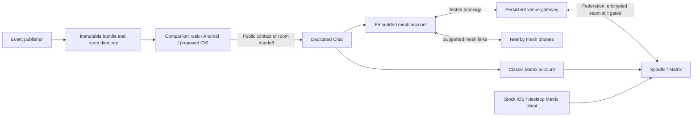

# IndiaFOSS Companion and Chat: proposed system architecture

8 September 2026. Architecture and backlog work only; no code commits. This extends the [review](review-2026-09-07.md) and [upstream assessment](https://github.com/hanthor/indiafoss-companion/issues/198). Proposed decisions below are recommendations, not claims of maintainer approval or implemented capabilities. The existing decisions to keep dedicated Chat, retire Capacitor, avoid plaintext portal bridging, and offer an existing MXID or temporary Spindle account remain the baseline.

## Product contract

An attendee should be able to prepare a useful day without an account, find their next session offline, meet someone and exchange a contact once, message through supported connectivity, and understand how to continue after the event. Remote attendees should join supported conference rooms through ordinary Matrix clients. Reliability and understandable recovery take priority over hiding meaningful identity or delivery changes.

Companion owns the conference day. Chat owns conversations and cryptographic accounts. A shared design language, contact format, and handoff make them feel related. Neither application must contain a second implementation of the other. In particular, replace Chat's duplicated conference WebView journey with a Companion handoff and useful browser fallback as a future implementation task.

## Components and ownership

| Component                             | Owns                                                                                  | Boundary                                                                                    |
| ------------------------------------- | ------------------------------------------------------------------------------------- | ------------------------------------------------------------------------------------------- |
| Event publishing pipeline             | Validated, immutable event revisions; provenance; conference room directory           | Public static data; no attendee account or private itinerary required                       |
| Companion PWA and Android native      | Offline schedule, plan, venue destinations, contacts, QR import/export, update status | Local first; Chat credentials and message history stay out                                  |
| Proposed SwiftUI Companion            | Same attendee contract, native reminders and sharing                                  | Independent of native mesh Chat; see [iOS architecture](ios.md)                             |
| Android Chat / proposed iOS Chat      | Matrix SDK clients, device keys, mesh node, conversation UI, outbox and media         | Account-scoped storage and lifecycle; transport-specific code behind narrow interfaces      |
| Contact and route coordinator in Chat | Validated person/account bindings, candidate routes, explicit continuation            | Never substitutes a public profile field for cryptographic account proof                    |
| Neutrino + iroh transport             | Local homeserver persistence and transport connectivity                               | Exposes measured capabilities and lifecycle; does not decide product-level identity merging |
| Venue gateways                        | Stable mesh identity, durable federation state, agreed room namespace                 | Infrastructure relay, not an attendee impersonator or plaintext decryptor                   |
| Spindle or tested classic homeserver  | Classic accounts, client/server API, federation and online service operations         | Temporary-account policy and current server compatibility must be rehearsed                 |
| Release operations                    | Exact component pins, device/topology evidence, recovery runbooks                     | A merged patch is not an installed-device acceptance result                                 |

The gateway edge above does not assert complete encrypted asynchronous delivery. Room federation, discovery, key exchange, and actual message decryption are separate acceptance gates.

## Share contracts, retain native interfaces

Keep web and Android Companion in the existing monorepo. Add a native iOS target there only after its admission gate; keep each Element X Chat fork separate. Keep protocol changes in the relevant Rust repositories. Publish shared schemas and golden fixtures from a clearly owned contracts directory in Companion initially; avoid a new service or repository merely to share small documents. Swift/Kotlin/TypeScript adapters validate the same fixtures. Extract shared executable logic only when divergence actually warrants it.

Version these contracts before expanding platform count:

| Contract                    | Required properties and compatibility policy                                                                                                                                                                                          |
| --------------------------- | ------------------------------------------------------------------------------------------------------------------------------------------------------------------------------------------------------------------------------------- |
| EventManifest / EventBundle | Schema version, event ID, immutable revision, content digest, publication time, timezone, stable session and venue IDs. Unknown optional fields tolerated; unsupported major versions rejected without losing the last good bundle.   |
| ConferenceDirectory         | Event ID, canonical aliases and room IDs where resolved, intended account/server route, visibility and supported capabilities. Alias resolution is authoritative; a QR never creates a replacement room silently.                     |
| ContactCard                 | Version, card key, minimal consented profile fields, optional claimed account references, signature, expiry/revocation interpretation. Import verifies structure and card signature; account claims receive independent trust states. |
| IdentityBinding             | Versioned canonical payload binding card/mesh/classic identifiers, issuer/device, intended scope, validity and revocation. Exact signature and Matrix trust verification specified in #188 before automatic routing.                  |
| AppHandoff                  | Version, action, event/contact/room reference and public proof material only. Bound size, allowed schemes/hosts, canonical parsing, explicit account choice where ambiguous. Never access tokens or private keys in URLs.             |
| Capability / ReleaseRecord  | Exact client, SDK, core and transport revisions plus tested topology, supported room/transport features and evidence. Unknown capability is unavailable until negotiated or demonstrated.                                             |

A bundle digest detects corruption, not authenticity if an attacker can replace the manifest too. Initial publisher trust is the controlled HTTPS origin and deployment access. If bundles later travel through untrusted peers, specify signed manifests, a pinned publisher key and rotation before trusting peer updates. Keep event-data revisions independent of app and protocol versions.

## Offline conference data and personal state

Treat published event data and personal decisions as separate stores. Plans refer to stable session IDs; updates must not replace preferences, imported contacts, dismissed notices or reminders. Maintain one atomically accepted bundle/revision per event, a pending candidate, and last-check/error metadata. Validate and persist a candidate before advertising success. Keep the last good version after storage/network failures. Session cancellations and reinstatements both produce correct plan changes.

Check on launch, foreground return, reconnect and manual refresh, with bounded fetch timeouts, freshness limits and retry backoff. Background refresh is opportunistic. Display the actual locally stored revision/time and make offline operation useful. Use the real 2026 bundle when published; never relabel a 2025 fixture as current data. Calendar export and native reminders derive from stable session IDs and are reconciled after time, venue or cancellation changes.

Provide an immediately useful browse/star/manual-plan path; ranking is optional refinement. Keep venue navigation to reliable destinations and highlighting until route accuracy is supported. Export/import personal state with format versioning and conflict preview; cloud synchronization is a separate opt-in feature, not a prerequisite.

## Identity and trust

Model `Person`, `ContactCardKey`, `MeshIdentity`, `MatrixAccount`, and `MatrixDevice` separately. A person can have several accounts/devices. An in-person meeting is evidence of a meeting; a signed card is evidence of control of that card key; a homeserver profile match is an account claim. None by itself is Matrix device verification.

Proposed binding flow: Chat proves possession of its mesh key and an authenticated classic device signs a domain-separated, versioned binding. The verifier checks both statements, fetches the relevant Matrix keys when possible, and records the source and strength of device trust. Specify the canonical encoding, replay/expiry rules, device deletion, cross-signing reset, key rotation and offline presentation in #188. A valid signature by an untrusted Matrix device must not become a human-verified badge. Offline verification can retain previously verified evidence; an uncheckable new claim stays pending.

The current profile comparison is inadequate for automatic routing. Explicitly correct ADR 0006's stronger claim rather than building on it. Let users inspect and unlink identities. Do not upload the attendee contact graph or broadcast human-readable profile data merely to enable discovery. Discovery should be opt-in and independently controllable from existing conversations.

## Account lifecycle and storage

Bring an existing MXID, or provision a temporary Spindle account under the recorded maintainer decision. Offline mesh onboarding works before provisioning; a persisted provisioning request can resume online without creating duplicate accounts. Treat the temporary account as a real separate account with disclosed expiry, operator, deletion/export policy and recovery limits.

Each account has its own SDK session, crypto store, media namespace, notification routing and logout operation. A coordinator can select an active account and later maintain multiple sessions; failure to start one must not erase another. Mesh-node keys must survive ordinary app restarts and upgrades. Companion stores neither Chat tokens nor Chat crypto databases. Sharing a device or visual profile does not authorize copying private keys between apps.

Before advertising post-event continuity, specify who runs the server, when temporary accounts expire, whether extension/migration is possible, what recovery material the attendee retains, and which history remains decryptable on another device. A backup hosted only on an expiring service is not a complete recovery plan. Changing an MXID does not transparently migrate room membership or encrypted history.

## Delivery and seamless continuation

Chat owns a durable logical outbox. Every send records a local logical ID, account and destination, payload/media references, per-route transaction IDs, attempts and observations. Suggested states: queued locally → submitting → accepted by route → recipient acknowledgement where available; failed, cancelled and outcome unknown remain explicit. Server acceptance is not recipient decryption; a read receipt is optional and distinct.

On a timeout, retry the same route with that route's idempotency mechanism where supported. A lost acknowledgement can leave delivery uncertain. Do not automatically resend through a different identity/room merely because a peer was not discovered. First ship explicit continuation with a preview of sender account, destination and possible duplicate. Later auto-selection requires a valid identity binding, usable encryption keys, reachable destination and a policy for ambiguous sends. Cancellation cannot retract a request already accepted elsewhere.

An optional person inbox is a projection over account-scoped conversations. Preserve sender provenance, room identity, original timestamps and per-room order. Map replies, edits, reactions, redactions and notification dedup only when an explicit mapping exists; matching message text is not a reliable dedup key. Different-membership groups stay separate. Unsupported stock clients may see two DMs; do not promise cross-route exactly-once delivery or universal merged threads.

## Rooms, federation and the encrypted seam

Use one preseeded conference room namespace and persist gateway identity/signing keys. Attendees resolve the same canonical room; offline failure queues a join or explains the unavailable route. No local recreation under a lookalike alias. Test membership, history visibility, room versions and signing on the exact deployed versions before relying on convergence.

The asynchronous encrypted seam is its own protocol workstream (#176), not a routing UI task. Its proposal must specify authenticated origin/destination, encrypted durable envelopes, replay defense, bounded queues/expiry, idempotent forwarding, device-list changes, authorized key queries and one-time-key claims, and encrypted to-device delivery. Specify what a gateway can observe and what compromise/rotation does. Do not enroll the relay as a decrypting participant to make a demo work. Reuse Matrix cryptography and upstream mechanisms; review extensions before implementation.

Required proof: a downstream phone and remote Matrix client exchange encrypted traffic in both directions through a gateway, with no simultaneous endpoint connectivity, after restart and key rotation. Direct patched gateway-to-Spindle success is useful but does not pass this scenario. Partitioned membership changes need explicit history/key-disclosure rules; revocation cannot retroactively erase plaintext already received.

Prefer powered, monitored gateways for continuity. Android relay devices are also subject to battery, process and radio limits. On isolated Wi-Fi, discovery is not proof of a working route; rehearse actual AP/VLAN/VPN configurations. Seeded peers avoid discovery dependency, not firewalls or AP isolation.

## Calls and media

Gate text, photos/files, voice messages, duplex voice and video separately. Media uploads need bounded size, durable references, retry and orphan cleanup. Prefer the maintained client's supported MatrixRTC path for online calls after testing the chosen deployment. The frozen Element Call full-mesh browser proof is not evidence for current native BLE calls. BLE/iroh calls require measured signaling, duplex audio, bandwidth, interruption and battery behavior; remain outside the conference commitment.

## IndiaFOSS 2026 identity and interface

Keep the detailed asset/surface plan in [#33](https://github.com/hanthor/indiafoss-companion/issues/33). Use a common family name, recognizable icon family, event artwork, concise launch/onboarding language and consistent contact/room handoff. Preserve the unofficial community-project disclosure. Record source revision and license for each borrowed asset from the [official branding repository](https://github.com/fossunited/Branding).

Use event green as an accent with accessible light/dark semantic tokens. Android follows native theme behavior, iOS follows system typography/Dynamic Type, and web uses readable responsive typography. Decorative pixel type belongs in short event headings, not chat messages or schedule details. Do not overwrite warning, trust, failed-send or unread semantics with promotional color. Keep Chat calm after the event; store the event edition in content, not account identity.

The [official event](https://fossunited.org/indiafoss/2026) lists 26–27 September; [workshops](https://www.fossunited.org/c/indiafoss/2026/workshops) are separate on 25 September. Include the right date/context in icons where applicable, landing pages, QR posters, onboarding, schedule, room directory and release screenshots. Verify the published schedule independently of its planned publication date.

## Delivery sequence and release evidence

| Workstream             | First reviewable outcome                                                 | Gate / existing owner issue        |
| ---------------------- | ------------------------------------------------------------------------ | ---------------------------------- |
| Conference reliability | Durable updates, real bundle, useful plan, QR handoff                    | Companion #189/#190/#191/#192/#31  |
| Installed Android mesh | Reproducible artifact, persistence, media and restart evidence           | Chat #44/#45/#49, Companion #182   |
| Account/trust          | Binding specification; coexistence and temporary-account recovery design | Companion #188/#181, Chat #46/#47  |
| Continuation           | Outbox and explicit route change; optional person projection later       | Chat #48                           |
| Venue service          | Canonical room seed, topology and restore rehearsal                      | Companion #163/#165/#166/#129/#115 |
| Encrypted federation   | Protocol review, then disconnected phone↔remote proof                    | Companion #176                     |
| iOS                    | PWA + tested standard-client handoff; independent native admission gates | iOS architecture and PR #179       |
| Calls                  | Current native online voice proof; later transport experiments           | Chat #26                           |

For September, recommend a small, proven conference release: reliable Companion, installed Android mesh, accurate account/QR behavior, and only rooms/topologies that pass rehearsal. Native iOS development and asynchronous relay must not block that release. The full target remains on #194 beyond the event. With the user now requesting architecture only, these are planned implementation stages, not resumed coding commitments.

Each release records client/SDK/core/transport/server hashes, build provenance, database versions, test device/OS, topology, timestamps and limitations. Exercise fresh install, upgrade, airplane mode, WAN loss with LAN retained, permission denial, background/lock, restart, lost acknowledgement, low storage, key rotation, account expiry and gateway restore. Measure successful decryptions and recovery rather than optimistic queue counts. Keep diagnostics opt-in and scrub tokens, keys, message content and contact identifiers.

Operations need a named service owner, TLS/DNS plan, account abuse controls, encrypted backups with restore drills, capacity/queue limits and a rollback compatible with stored data. Spindle's new release is still explicitly unstable; pinning a tag does not solve migration risk. Prefer scope reduction to an untested last-minute upgrade. Do not close issues for an architecture document, passing host tests, or upstream merges alone.

## Decisions still requiring a maintainer choice

The recommended defaults are: staged opt-in person merging; existing MXID or transparent temporary account; no compulsory cloud archive; PWA as 2026 iOS baseline; native Companion admitted independently; iOS mesh participant before relay; protocol extensions reviewed before coding. Record acceptance or alternatives in #181. The most consequential unresolved choices are temporary-account lifetime/operator, canonical service domains and room policy, the iOS distribution owner and supported OS floor, and the maintenance capacity for another Chat fork.
