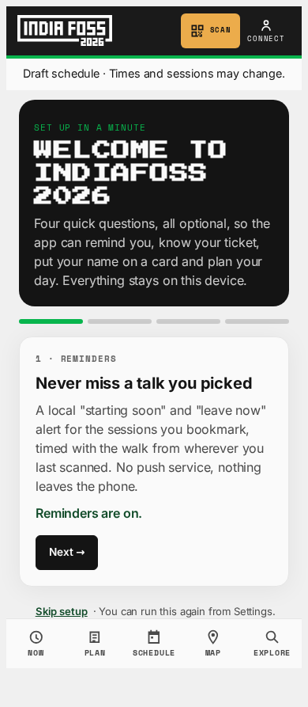
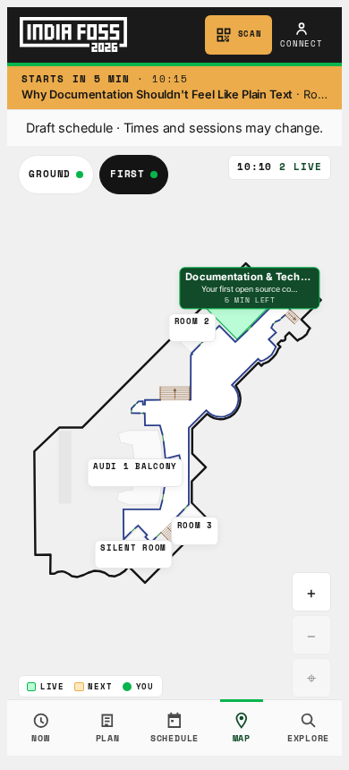
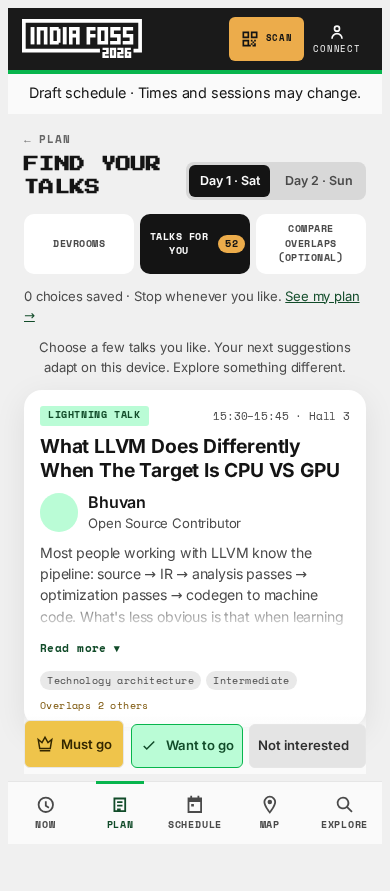

# PWA UX review: reminders, map, and talk planning

Status note, 9 September: this is a historical before-change review. Reminder permission honesty and routing-profile consistency were subsequently addressed (#220/#222 closed). Use the [current persona walkthrough](attendee-personas-2026-09-09.md) for fresh observations and remaining priorities; do not reopen fixed findings from these screenshots alone.

Reviewed the 2026 PWA at a 390 × 844 mobile viewport, including onboarding with a simulated denied notification permission, discovery, a positive talk choice, the generated plan, map during the event, and Settings. Screenshots below are the **before-change** state. This is an automated Chromium walkthrough plus source review, not volunteer usability testing or an installed iPhone/Android delivery test. No horizontal overflow appeared in these five views.

## Main finding

The app has useful individual screens, but different screens currently disagree about what the attendee chose. Finish the path **discover → resolve a plan → navigate → receive reminders** before adding more ranking controls. A right swipe is an interest signal; scheduling feasibility must remain a separate decision. A talk excluded because of a clash is not a disliked topic.

## P1: notification permission and delivery promises are misleading

Reproduction: open `/welcome` with `Notification.permission` returning `denied`, press Turn on reminders. The page displays **Reminders are on**. `setNotificationsEnabled` stores `true` before requesting permission and ignores the transport's boolean result; the wizard's success branch hides the denied warning. A browser without the Notification API similarly cannot support the promised result.

`WebLocalNotificationTransport` schedules page timers and constructs `new Notification`. This is not a durable background alarm service. The wizard says “Never miss a talk” without explaining that a suspended/closed PWA cannot rely on those timers. iPhone Web Push requires the appropriate installed Home Screen web app and a push implementation; installation alone does not turn these timers into background delivery. See [WebKit's Web Push documentation](https://webkit.org/blog/13878/web-push-for-web-apps-on-ios-and-ipados/) and [Apple's implementation guide](https://developer.apple.com/documentation/usernotifications/sending-web-push-notifications-in-web-apps-and-browsers).

Proposal: represent off, requesting, granted, blocked and unsupported separately; only show enabled after success. Explain the actual delivery mode in plain language, offer a test reminder and calendar export, and test granted/denied/dismissed/unsupported paths. Decide separately whether to build Web Push or explicitly position PWA reminders as foreground assistance. Do not promise lock-screen delivery without installed-device evidence.

## P1: the selected plan does not drive every attendee surface

`solver.svelte.ts` uses positive triage and whole-devroom reservations. `notifications.svelte.ts` assigns reminder tiers from must-attend and bookmarks only. `FloorPlan.svelte` calls `computeNextUp` with bookmarks but no must-attend predicate; the global LeaveByBanner does pass must-attend. Neither is derived from the edited itinerary. A right-swiped talk or reserved devroom can affect the plan without becoming the map's destination or an ordinary reminder. Conversely, a bookmarked talk removed from the plan can still receive reminders.

Proposal: create one resolved, edited-plan projection consumed by Plan, Now, map and reminder scheduling. Keep “interested” separate from “scheduled”; show a clear explanation when a liked talk cannot fit. Cancel reminders for removed/replaced/cancelled entries. Use the same current-day choice on all screens. Acceptance should walk through right swipe, must go, whole devroom, overlapping selections, removal, replacement, and a schedule revision.

## P1: routing preferences are inconsistent

The solver honours `routingPrefs.profile`; the map's next-up calculation, global leave-by banner and notification route lookup hard-code `fastest`. A person needing an accessible route could get a feasible plan calculated one way and departure advice calculated another.

Proposal: all routing consumers use the same saved profile. Put a visible accessible/avoid-stairs control in the map journey. If a route is unavailable, explain that rather than substitute an unlabelled walking estimate. Verify a graph where the accessible route is longer and a destination has no accessible route.

## P2: the map needs a clearer destination workflow

The floor plan, live-room indicators, zoom controls and room sheet are useful. On the phone view, the long devroom title is truncated and the map gives little initial guidance about setting a starting point. `FloorPlan.svelte` highlights a requested destination and can set “I'm here”, but does not draw a point-to-point route or show route steps. The live programme label can obscure the stable physical room identity.

Proposal: make “From: set where I am” and “To: next planned talk / choose a room” explicit. Keep physical room and current devroom visible together in the sheet; add departure time, walking estimate, floor changes and route steps. Label the location as manually set, with a way to change/clear it. A person arriving without a plan should still find a named room without first learning the recommendation flow.

## P2: make discovery a short, reversible conversation

The card, abstract expansion, three coloured buttons and optional devroom choice are a good base. The initial screen gives no explicit swipe instruction; answer reversal is behind Change answered. The full-deck count and native progress bar imply a completion quota despite “Stop any time”. Plan uses Must attend, Lock and bookmarked while discovery uses Must go and Want to go; these need a single user-facing explanation. The itinerary needs a reason per suggestion, and conflicts need actions that resolve the specific choice, not a generic return to discovery.

In this implementation pass: explicit left/right instructions and matching feedback stamps, immediate Undo last choice, cancellation-safe web gestures, density-scaled native thresholds, and recommendation exploration that survives recomputing after each answer. Keep buttons and keyboard support; never let vertical scrolling or an interrupted gesture submit a negative answer.

Next: reduce completion pressure, offer optional topic/devroom seeds, show “because you liked…” reasons, and separate “not interested” from “can't fit this time”. Keep browsing and a useful plan available without completing the deck. Observe real attendees before claiming that these changes improve completion time.

## Backlog

- [#220: truthful notification state and delivery](https://github.com/hanthor/indiafoss-companion/issues/220)
- [#221: one resolved plan for Now, map and reminders](https://github.com/hanthor/indiafoss-companion/issues/221)
- [#222: consistent accessible routing profile](https://github.com/hanthor/indiafoss-companion/issues/222)
- [#223: clear map origin, destination and floor-change flow](https://github.com/hanthor/indiafoss-companion/issues/223)
- [#192](https://github.com/hanthor/indiafoss-companion/issues/192) retains discovery, plan explanations and real-attendee walkthroughs. Research references and the adaptive feedback loop are in [recommendation patterns](../recommendation-patterns.md).
