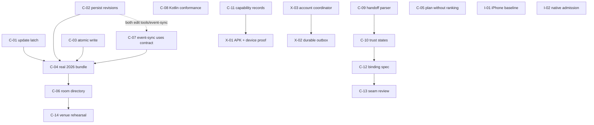

# Implementation tasks

Each file here is one self-contained unit of work derived from the architecture
record in [`docs/architecture/`](../architecture/). A spec inlines the context
it needs, names the exact files, and states acceptance as commands you can run.
You should not have to read #194 to do one.

**These are specs, not tickets.** The GitHub issues listed in the _Tracks_
column already own this work; a spec says _how_, the issue says _whether_ and
records the decision. Do not open new issues for these.

## Rules for whoever implements one

1. **Read the whole spec before editing.** The _Out of scope_ section is
   load-bearing — most of these tasks sit next to something deliberately not
   being done yet.
2. **Do not widen the task.** If you find a second bug, note it on the tracking
   issue and leave it. A change that fixes two things is a change nobody can
   revert.
3. **Acceptance commands must actually pass**, and you must paste real output.
   A merged patch is not an installed-device result — several specs below turn
   on exactly that distinction.
   - **Rebuild before running Playwright.** `npx playwright test` serves
     whatever is already in `apps/web/build`, so it will happily pass against
     a build made before your change. Use `just test-e2e` (which depends on
     `build`) or run `just build` first. This has already produced one green
     local run for a change CI then rejected.
   - **`just android-test` runs both core and app tests.** It requires JDK 21
     and the Android SDK; see [Android testing](../android-testing.md).
     `just android-core-test` is explicitly core-only. Say which gate ran,
     and require native CI plus emulator success for native changes.
4. **If the spec is wrong, stop and say so.** The architecture document wins
   over the spec, and reality wins over both. Do not implement something you
   can see is incorrect.
5. **Fork-touching work updates `docs/forks.md` in the same change.** This is a
   repository rule, not a preference.
6. Contracts and fixtures live in
   [`packages/model/src/contracts/`](../../packages/model/src/contracts) and
   [`packages/test-fixtures/fixtures/`](../../packages/test-fixtures/fixtures)
   (ADR 0009). Reuse them; do not hand-roll a second parser.

## Status vocabulary

| Status             | Meaning                                                                                                                                               |
| ------------------ | ----------------------------------------------------------------------------------------------------------------------------------------------------- |
| **Ready**          | Everything needed is in the repository. Start now.                                                                                                    |
| **Needs hardware** | Ready, but acceptance requires physical devices or the venue network.                                                                                 |
| **Blocked**        | A named decision or protocol review must land first. The spec says which.                                                                             |
| **Implemented**    | Merged to `main` in the cited pull request, whose body carries the CI evidence. Not a device result; any remaining acceptance names its owning issue. |

## Companion — conference reliability (the September release path)

These are the work that makes a conference day trustworthy. Do these first.

| ID                                           | Task                                           | Status                                                                                                                                                                                                                                                 | Tracks                                                                                                                                        |
| -------------------------------------------- | ---------------------------------------------- | ------------------------------------------------------------------------------------------------------------------------------------------------------------------------------------------------------------------------------------------------------ | --------------------------------------------------------------------------------------------------------------------------------------------- |
| [C-01](C-01-update-check-latch.md)           | Update checks and truthful freshness           | Implemented, PR #238; #189 closed                                                                                                                                                                                                                      | [#189](https://github.com/hanthor/indiafoss-companion/issues/189)                                                                             |
| [C-02](C-02-persist-every-valid-revision.md) | Metadata-only adoption and reinstatement       | Implemented, PRs #235/#251/#252                                                                                                                                                                                                                        | [#190](https://github.com/hanthor/indiafoss-companion/issues/190)                                                                             |
| [C-03](C-03-android-atomic-bundle-write.md)  | Coherent, verified native cache recovery       | Implemented, PR #251                                                                                                                                                                                                                                   | [#190](https://github.com/hanthor/indiafoss-companion/issues/190)                                                                             |
| [C-04](C-04-publish-2026-bundle.md)          | Publish the real 2026 schedule                 | Published and automatically updated, PRs #242/#243; venue rehearsal remains                                                                                                                                                                            | [#191](https://github.com/hanthor/indiafoss-companion/issues/191)                                                                             |
| [C-05](C-05-plan-without-ranking.md)         | Three-choice discovery and whole-devroom plans | Implemented: discovery/planning (#192 closed); resolved plan behind Now, map and reminders on both platforms, PRs #266/#267 (PWA) and #304 (native), #221 closed; clash resolution PWA #297. Native clash resolution and replacement UI remain in #110 | [#192](https://github.com/hanthor/indiafoss-companion/issues/192) (closed), [#110](https://github.com/hanthor/indiafoss-companion/issues/110) |

Personal-data migration is tracked by [#240](https://github.com/hanthor/indiafoss-companion/issues/240),
with its current contract and remaining work in
[personal-data transfer](../architecture/personal-data-transfer.md). CFP reference
resolution, shared file codecs, the PWA export and the PWA import are merged
(#247/#249/#250/#301); the native export, the journaled native import and the
cross-platform fixture tests follow in the native slice. A transfer between
real devices and storing unresolved records on the destination remain. Do not
mark migration complete on test evidence alone.

Current event-data maintenance is documented in the [2026 event README](../../events/indiafoss-2026/README.md).
The [booth import review](../reviews/booth-directory-2026-09-09.md) records the organiser's 71-booth snapshot and day-aware PWA visit planning.
Automatic spreadsheet refresh, booth map positions and native visit planning remain under #191/#221; portable booth preferences remain under #240.
The [native seed evidence](../reviews/native-seed-2026-09-09.md) records the actual downloaded revision 7 APK verification after #255/#256.

The [Now resolved-plan slice](../reviews/now-resolved-plan-2026-09-09.md) shares generation/edit validation between Plan and Now and restricts Now's leave-by banner to that plan; #267 extended it to the map and reminders on the PWA, and #304 built the native counterpart (`core/ResolvedPlan.kt`) behind Now, map, banner, calendar export and reminders. #221 is closed. Native schedule markers (#303) derive from the greedy itinerary, not that projection, and native has no clash-resolution or replacement UI (#297/#304 non-claims, #110).

Merged on 10 September outside the spec list, each with the evidence its PR body cites and no device claim: organiser venue and OpenStreetMap arrival handoff (#295), organiser-session classification and source links (#296), desktop PWA layout (#298, #309), map From/To and route steps (#299), the native app-owned calendar (#302, device acceptance open), Chat APK downloads on Connect and Settings (#277), Obtainium and F-Droid install channels (#308), `@indiafoss/matrix` pruned to profile checks and handoff helpers (#314), the versioned identity envelope (#315), native 2026 branding (#313) and the bindings provenance chain (#305). The [system architecture](../architecture/system.md#implementation-status-10-september-2026) carries the shipped-versus-proposed table.

## Companion — contracts and handoff

| ID                                                 | Task                                              | Status                                                                                                                                                                                                                                                                           | Tracks                                                                                                                             |
| -------------------------------------------------- | ------------------------------------------------- | -------------------------------------------------------------------------------------------------------------------------------------------------------------------------------------------------------------------------------------------------------------------------------- | ---------------------------------------------------------------------------------------------------------------------------------- |
| [C-06](C-06-publish-conference-directory.md)       | Publish and validate the canonical room directory | Ready                                                                                                                                                                                                                                                                            | [#166](https://github.com/hanthor/indiafoss-companion/issues/166)                                                                  |
| [C-07](C-07-event-sync-uses-contract.md)           | `event-sync` uses the owned `EventManifest` type  | Ready                                                                                                                                                                                                                                                                            | ADR 0009                                                                                                                           |
| [C-08](C-08-kotlin-fixture-conformance.md)         | Kotlin validates the same golden fixtures         | Ready                                                                                                                                                                                                                                                                            | ADR 0009                                                                                                                           |
| [C-09](C-09-handoff-parse-consolidation.md)        | One handoff parser, both encodings                | Ready                                                                                                                                                                                                                                                                            | [#31](https://github.com/hanthor/indiafoss-companion/issues/31)                                                                    |
| [C-10](C-10-contact-trust-states.md)               | Never show a profile match as verified            | Implemented (PWA), PR #300: card signature, in-person, profile match and Chat verification are separate; `verified` → `profile-matched` with read-path migration; Kotlin fixture conformance deliberately not wired (spec step 8). Identity envelope #315 keeps the fields apart | [#31](https://github.com/hanthor/indiafoss-companion/issues/31), [#188](https://github.com/hanthor/indiafoss-companion/issues/188) |
| [C-11](C-11-capability-record-release-evidence.md) | Releases record what was actually tested          | Ready                                                                                                                                                                                                                                                                            | [#34](https://github.com/hanthor/indiafoss-companion/issues/34)                                                                    |

## Companion — gated work

| ID                                             | Task                                        | Status                                                                                                                                                                                                           | Tracks                                                                                                                                                                                                  |
| ---------------------------------------------- | ------------------------------------------- | ---------------------------------------------------------------------------------------------------------------------------------------------------------------------------------------------------------------- | ------------------------------------------------------------------------------------------------------------------------------------------------------------------------------------------------------- |
| [C-12](C-12-identity-binding-spec.md)          | Specify the mesh↔Matrix identity binding    | In review — spec (`docs/identity-binding.md`) and verifier landed on both platforms; `binding-valid` is produced from a verified binding and stops there; #181 decisions assumed, not cited; #188 review pending | [#188](https://github.com/hanthor/indiafoss-companion/issues/188), [#181](https://github.com/hanthor/indiafoss-companion/issues/181)                                                                    |
| [C-13](C-13-encrypted-seam-protocol-review.md) | Protocol review for the encrypted seam      | Blocked — review before code                                                                                                                                                                                     | [#176](https://github.com/hanthor/indiafoss-companion/issues/176)                                                                                                                                       |
| [C-14](C-14-venue-gateway-rehearsal.md)        | Rehearse the venue gateway and room seeding | Needs hardware                                                                                                                                                                                                   | [#163](https://github.com/hanthor/indiafoss-companion/issues/163), [#165](https://github.com/hanthor/indiafoss-companion/issues/165), [#115](https://github.com/hanthor/indiafoss-companion/issues/115) |

## iOS

| ID                                   | Task                                                         | Status                   | Tracks                                                                                                                                |
| ------------------------------------ | ------------------------------------------------------------ | ------------------------ | ------------------------------------------------------------------------------------------------------------------------------------- |
| [I-01](I-01-ios-pwa-baseline.md)     | Rehearse the 2026 iPhone baseline: PWA + stock Matrix client | Needs hardware           | [#199](https://github.com/hanthor/indiafoss-companion/issues/199)                                                                     |
| [I-02](I-02-ios-native-admission.md) | Assemble the native Companion admission dossier              | Blocked — admission gate | [#199](https://github.com/hanthor/indiafoss-companion/issues/199), [PR #179](https://github.com/hanthor/indiafoss-companion/pull/179) |

## Chat — a different repository

These specs live here because the architecture does, but the work happens in
[`indiafoss-chat-android`](https://github.com/hanthor/indiafoss-chat-android).
**Do not create Kotlin or Swift files in this repository for them.**

| ID                                       | Task                                                     | Status                                                                                                                                                                                                                                                                | Tracks                                                                          |
| ---------------------------------------- | -------------------------------------------------------- | --------------------------------------------------------------------------------------------------------------------------------------------------------------------------------------------------------------------------------------------------------------------- | ------------------------------------------------------------------------------- |
| [X-01](X-01-chat-media-pin-and-proof.md) | Build the media fix into an installable APK and prove it | Needs hardware; build/test checkout restored in Chat #55. The bindings are now a provenance-named pinned artifact: `neutrino-bindings-0.8.2-e2ee.2d85348-ble.15117e9` built from `hanthor/neutrino-iroh@15117e9` (#305) and pinned by version and SHA-256 in Chat #62 | Chat #45/#49, [#182](https://github.com/hanthor/indiafoss-companion/issues/182) |
| [X-02](X-02-chat-durable-outbox.md)      | A durable logical outbox with honest delivery states     | Ready                                                                                                                                                                                                                                                                 | Chat #48                                                                        |
| [X-03](X-03-chat-account-coordinator.md) | Account coexistence without one session erasing another  | Ready. Chat #59's `ConferenceLinkDispatcher` centralises link handling but is not account-aware (Chat #46 out of scope there)                                                                                                                                         | Chat #46/#47                                                                    |

## Dependency order



C-08 and I-01 have no prerequisites and can run alongside anything; C-05 is implemented. C-10 is implemented on the PWA, and C-12's specification and verifier landed in #324; C-12 now waits on the #188 review.

Two couplings the arrows understate, both found while writing the specs:

- **C-02 and C-07 both change `tools/event-sync`.** C-02 adds a `reinstated`
  change type, which then appears in the published `changes.<rev>.json`; C-07
  replaces that tool's local `EventManifest` declaration. Neither blocks the
  other, but doing them in parallel will conflict. Take them in either order,
  one at a time.
- **C-03 needs the full native gate.** `just android-test` covers both
  `:core:test` and `:app:testDebugUnitTest`; `just android-core-test` alone
  cannot validate `EventRepository` or app wiring.

## Spec template

New specs use this shape. Keep _Context_ self-contained — inline the
architecture excerpt rather than linking to it.

```markdown
# <ID> — <one-line outcome, in the user's terms>

- Status: Ready | Needs hardware | Blocked — <what unblocks it>
- Repository: indiafoss-companion | indiafoss-chat-android | neutrino
- Tracks: #NNN
- Size: S | M | L

## Why this matters

<The attendee-visible consequence. Two or three sentences.>

## Context you need

<Everything required to do the work, inlined. Quote the architecture, quote
the current code, name the file:line. Assume the reader has read nothing.>

## What to do

<Numbered, concrete steps. Name exact files and functions.>

## Acceptance

<Runnable commands and the observable outcome of each. Include the negative
case — what must still fail.>

## Out of scope

<What not to touch, and why. Name the task or issue that owns it instead.>
```
